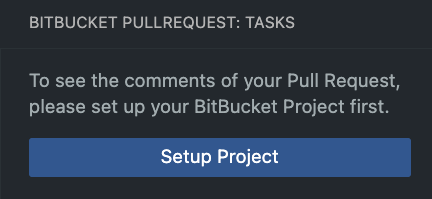

# bitbucket-pullrequest-tasks

A VS Code extension that displays tasks and comments of the corresponding Pull Request for your current branch in BitBucket. It is currently only tested with BitBucket server vesion 7.21.0.

## Quickstart

Once you've added this extension, get a new icon in the left toolbar.

When it's your first time, you need to configure it.

When you click on "Authenticate" you need to add your BitBucket Access Token (https://bitbucket.hmmh.de/plugins/servlet/access-tokens/users/YOUR.USER/manage).
After that you can set up your project, by specifying the host url of your BitBucket server, the BitBucket project and the Repository name. Normally those values should be prefilled.

Once everything is set up and there is a Pull Request, you will get three sections in that sidebar.

### Tasks
The first section shows all tasks of the current Pull Request. You can click on a task to open the file and jump to the line where the task is located.

## Authentication

### Via user credentials
Not implemented yet.

### Via access token
* Go to https://bitbucket.hmmh.de/plugins/servlet/access-tokens/users/YOUR.USER/manage
* Generate token
* Run command "Bitbucket PullRequest Tasks: Authenticate with token""
* Enter your token

## BitBucket Setup

* Run "Bitbucket PullRequest Tasks: Setup Project""
* Enter host url, project name and Repository name